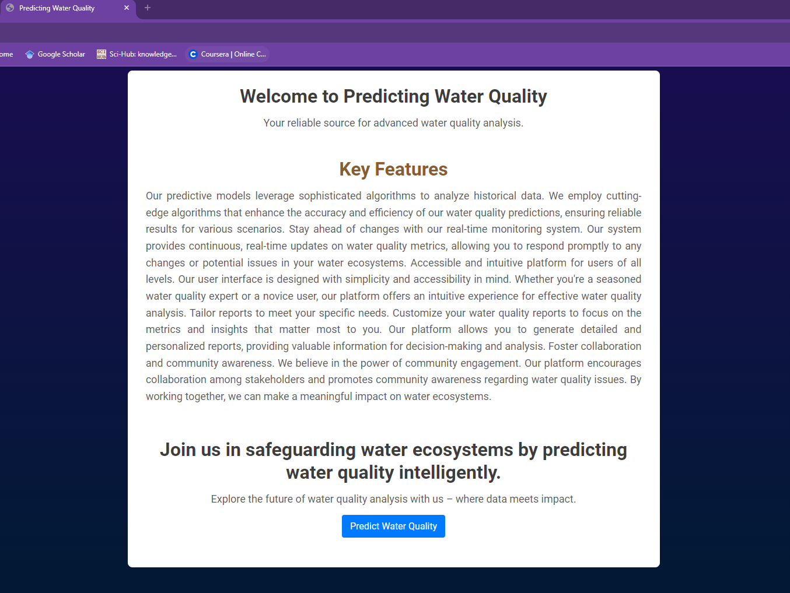
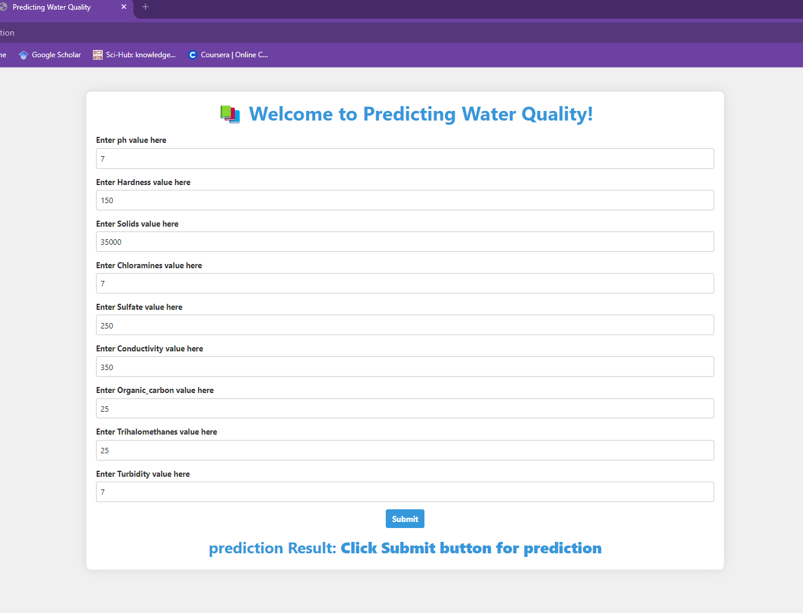
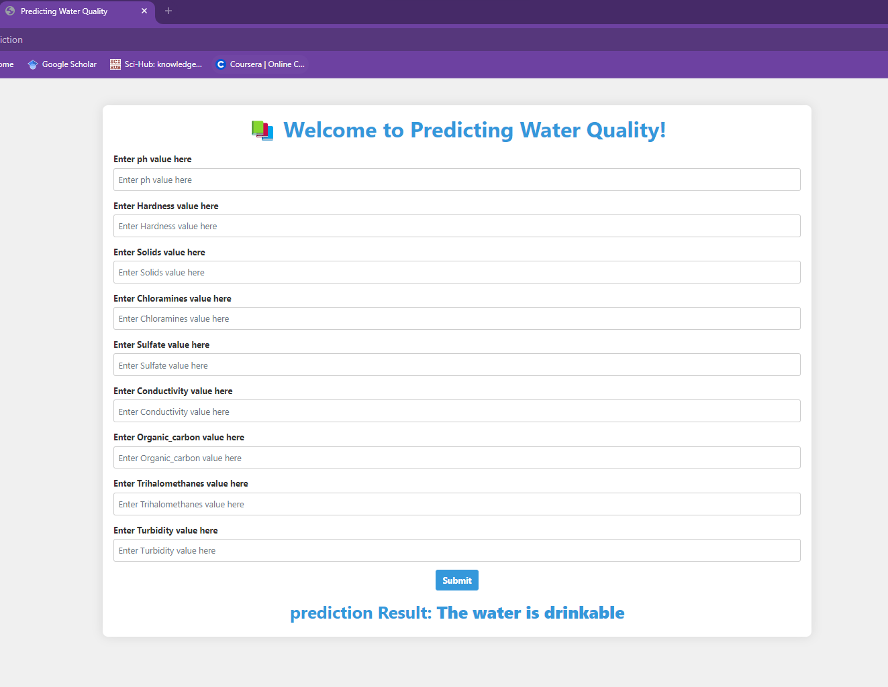

### End to End Machine Learning project using basic Classification algorithm 

### Welcome to Predicting Water Quality
#### Your reliable source for advanced water quality analysis.

 Stay ahead of changes with our real-time monitoring system. Our system provides continuous, real-time updates on water quality metrics, allowing you to respond promptly to any changes or potential issues in your water ecosystems. Accessible and intuitive platform for users of all levels.

 ### Output of the following project

 - A landing page with an introduction to the project and its purpose.

- Giving input for prediction

- After making prediction
  
